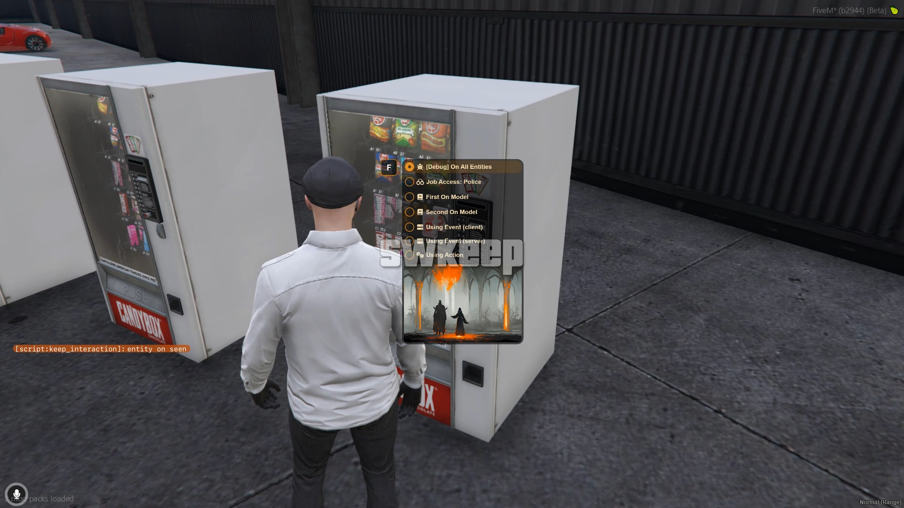
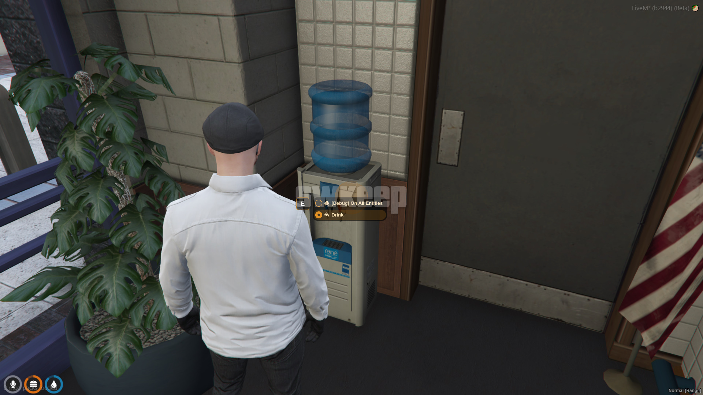
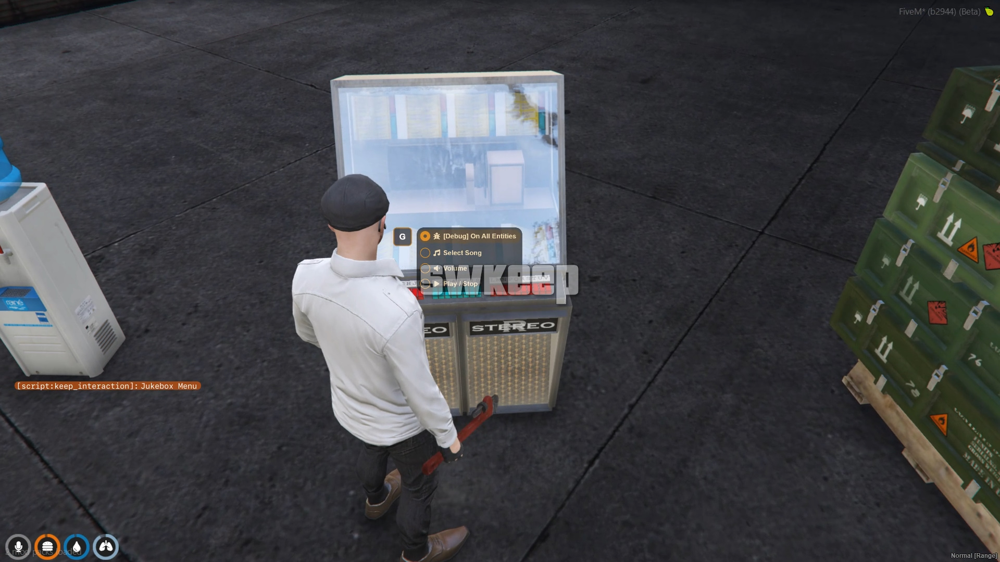
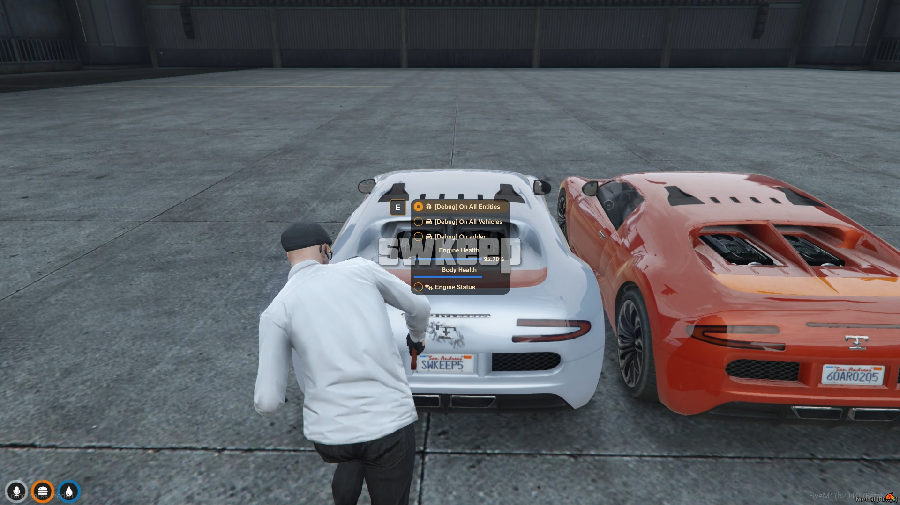
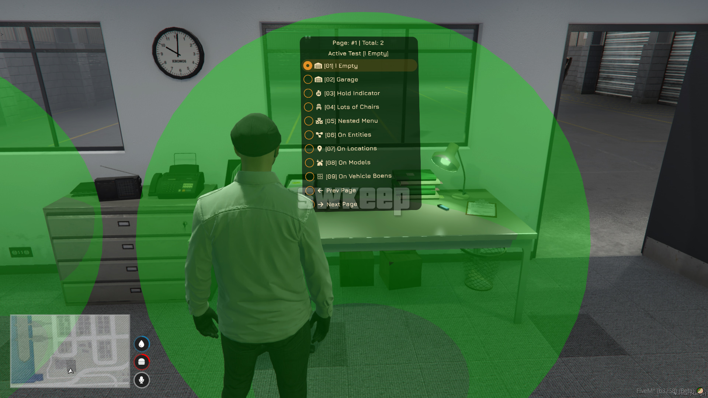

# Interaction Menu

A standalone DUI-based interaction menu for FiveM, designed to enhance player interactions with the environment on your server.

This menu isn't designed to replace target scripts (though you could, but it would take quite a bit of effort on your end). Instead, it's meant to work alongside them, adding an extra layer of interactions to players. That said, keep in mind that the script uses sprites and DUI, which can be more resource-intensive compared to NUI-based scripts (nothing to worry about if you have some experience with scripting).

## Preview

    <table>
    <tr>
        <td align="center">
            
        </td>
        <td align="center">
            
        </td>
        <td align="center">
            
        </td>
    </tr>
    </table>

    <table>
    <tr>
        <td align="center">
            
        </td>
        <td align="center">
            
        </td>
    </tr>
    </table>

**[Watch on YouTube](https://www.youtube.com/watch?v=7ylxnj4HC5A)**

## Download

**[Get the latest release](https://github.com/swkeep/interaction-menu/releases/latest)**

## Documentation

**[Click Here](https://swkeep.com)**

## Developer Tools and Examples

The script includes numerous examples in the `/lua/examples` directory to help you get started.

To explore these examples live within your server:
1. Set `Config.devMode` and `Config.debugPoly` to `true` in `config.shared.lua`.
2. This enables developer mode, allowing you to see and interact with the examples in real time.

**Important:** Remember to disable developer mode when you're done testing for optimal performance.

    

<!-- CONTRIBUTING -->
## Contributing

Contributions are what make the open source community such an amazing place to learn, inspire, and create. Any contributions you make are **greatly appreciated**.

If you have a suggestion that would make this better, please fork the repo and create a pull request. You can also simply open an issue with the tag "enhancement".

Don't forget to give the project a star! Thanks again!

<!-- LICENSE -->
## License

See `LICENSE` for more information.

<!-- CONTACT -->
## Contact

Swkeep - [@Discord](https://discord.gg/ccMArCwrPV)
