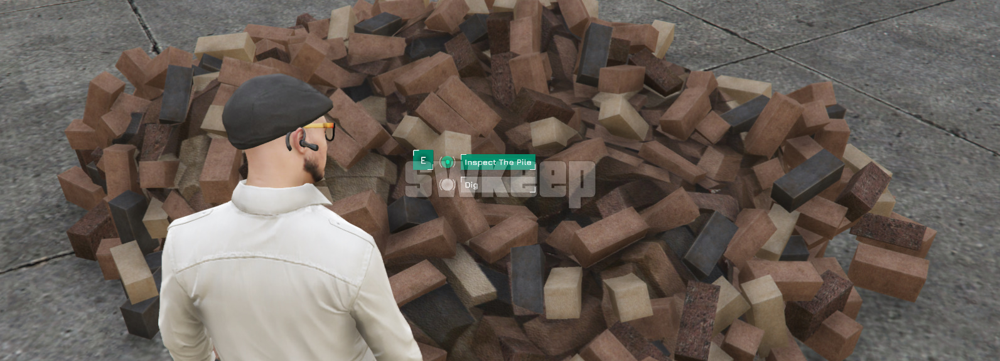

# Interaction Menu

    

Interaction menu is a modular, raycast, zone and entitiy based interaction system for FiveM. It leverages sprites and DUI to render rich, in-game menus, allowing players to interact with entities, world positions, zones, vehicles, and more. Menus are tracked in a centralized container structure and automatically cleaned up via a dedicated garbage collector.

## Features

The script offer a wide range of features, including:

* A dedicated `HTML template engine` for creating custom options
* Dedicated media components, picture, music, and video players
* Multiple triggers for events, commands, exports and more
* A variety of pre-made beautiful themes
* Full customization of existing themes and the ability to add new ones with ease
* Bridges for compatibility with target scripts like `ox_target` and `qb-target`
* `3D Menus` to maintain player immersion in the game world
* User Friendly Syntax, clear, straightforward, and easy to pick up

…and many more features waiting to be discovered and brought to life with your creativity!

## Preview

<table>
<tr>
    <td align="center">
        
    </td>
    <td align="center">
        
    </td>
    <td align="center">
        
    </td>
    <td align="center">
        
    </td>
    <td align="center">
        
    </td>
</tr>
</table>

**[Watch on YouTube](https://www.youtube.com/watch?v=7ylxnj4HC5A)**

## Download

**[Get the latest release](https://github.com/swkeep/interaction-menu/releases/latest)**

## Documentation

Documentation is still a work in progress.  
In the meantime, check out the examples in [`/lua/examples`](./lua/examples) for guidance.

## Developer Tools and Examples

The script includes numerous examples in the `/lua/examples` directory to help you get started.

To explore these examples live within your server:
1. Set `Config.devMode` and `Config.debugPoly` to `true` in `config.shared.lua`.
2. This enables developer mode, allowing you to see and interact with the examples in real time.

**Important:** Remember to disable developer mode when you're done testing for optimal performance.

<!-- CONTRIBUTING -->
## Contributing

Contributions are what make the open source community such an amazing place to learn, inspire, and create. Any contributions you make are **greatly appreciated**.

If you have a suggestion that would make this better, please fork the repo and create a pull request. You can also simply open an issue with the tag "enhancement".

Don't forget to give the project a star! Thanks again!

<!-- LICENSE -->
## License

See `LICENSE` for more information.

<!-- CONTACT -->
## Contact & Support

For questions, support, or community discussions, join **Swkeep** on [Discord](https://discord.gg/ccMArCwrPV) 